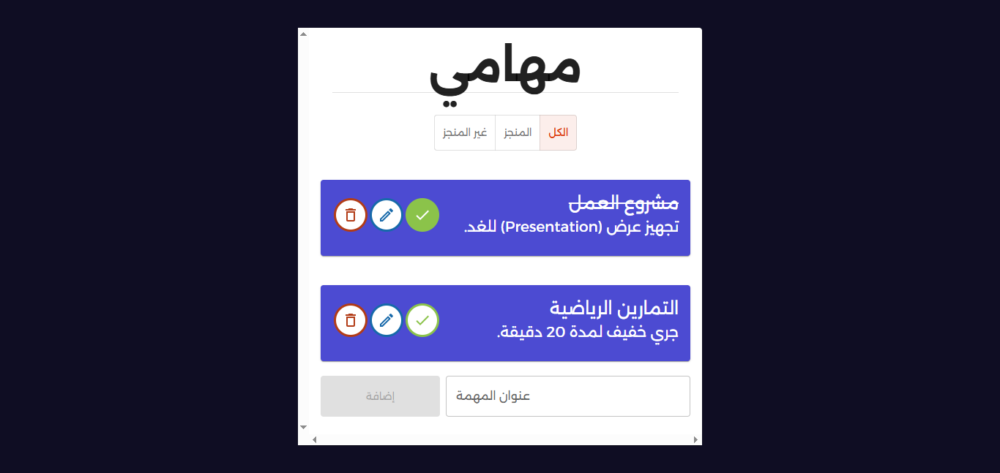
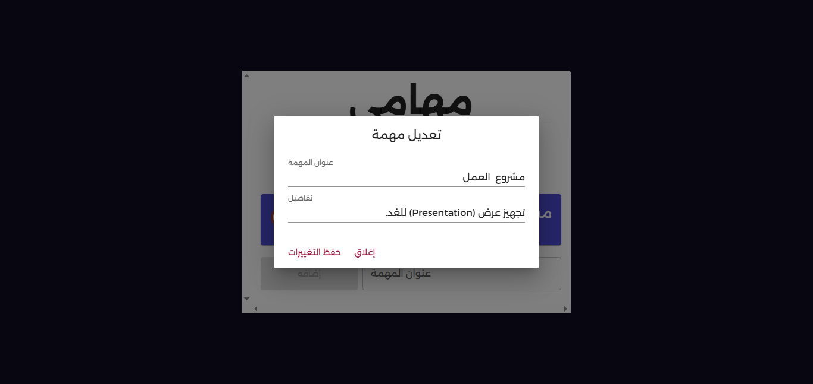
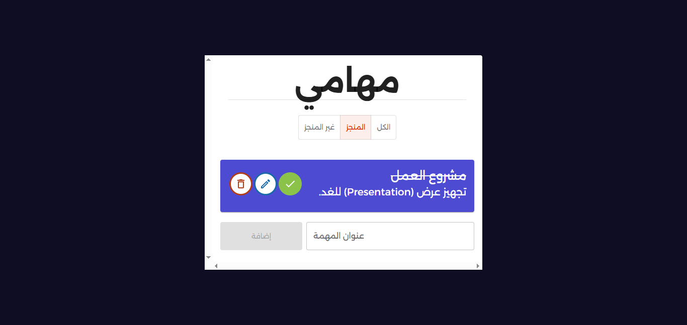
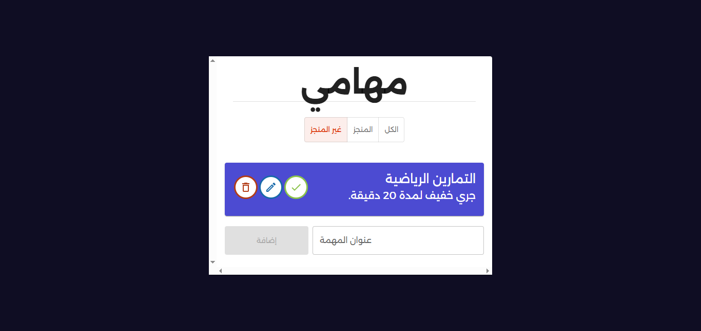
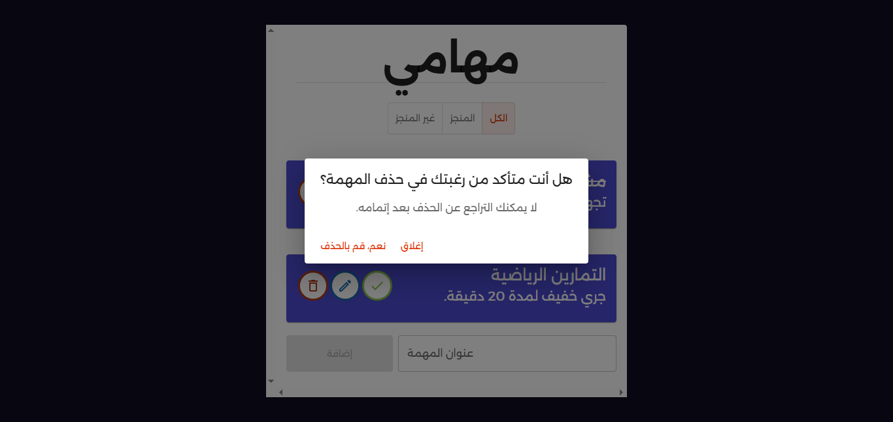

# 📝 React Todo List App

A simple and modern **Todo List Application** built with **React** and **Material UI (MUI)**.  
This app allows you to create, update, complete, and delete tasks, with a clean UI and responsive design.

---

## 🚀 Features

- ➕ Add new tasks with title & details
- ✅ Mark tasks as **completed** or **non-completed**
- ✏️ Update task title
- 🗑️ Delete tasks (with confirmation dialog)
- 📂 Filter tasks by:
    - All
    - Completed
    - Non-completed
- 🎨 Styled using **Material UI** with custom theme
- 💾 Save todos to localStorage 

---

## 🛠️ Tech Stack

- ⚛️ **React** (hooks: useState, useContext)
- 🎨 **Material UI (MUI)** for UI components
- 🆔 **UUID** for generating unique task IDs
- 📦 **Context API** for state management

---

## 📂 Project Structure  
`````
  src/
  │── components/
  │ ├── List.jsx # Single Todo Item (Card with actions)
  │ ├── Lists.jsx # Displays filtered list of todos
  │ 
  │
  │── contexts/
  │ └── todosContext.js # Context Provider for todos
  │
  │── App.jsx # Main app with filtering & state
  │── index.js # Entry point
`````

---

## ▶️ Installation & Setup

1. Clone the repo:
```
   git clone https://github.com/ousafa/todo-app.git
   cd todo-app
   npm install
  `````
---
## 📸 Screenshots






---
## 📚 Resources & Credits
This project was built by following the tutorials from [أكاديمية ترميز](https://www.youtube.com/@tarmeez) on YouTube.  
Big thanks to their content for helping me learn and apply React concepts in practice. 🚀
